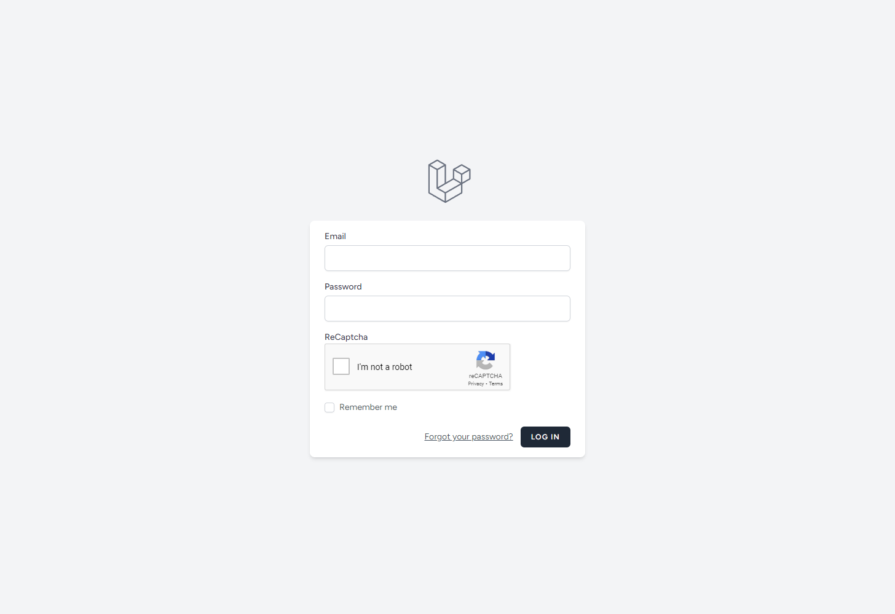

# Laravel Project



Buatlah aplikasi login form dengan menggunakan Laravel dengan aturan sebagai berikut:

- [x] Form reset password.
- [x] Register user dan password.
- [x] Password mempunyai kombinasi huruf kecil, huruf besar, angka, dan symbol.
- [x] Jumlah password minimal 10 karakter.
- [x] Jika kombinasi password tidak terpenuhi maka akan keluar alert agar user memenuhi kombinasi yang sudah ditetapkan.
- [x] Terdapat validasi user dan password, jika gagal 3 kali maka terdapat counter waktu untuk di ijinkan masuk kembali dalam waktu 30 detik selanjutnya.
- [x] Pada form login terdapat validasi (anda dapat gunakan jenis captcha atau jenis lainnya).

## Installation

1. Clone repository ini.
2. Jalankan perintah `composer install` untuk menginstall dependency.
3. Jalankan perintah `npm install` untuk menginstall dependency.
4. Jalankan perintah `npm run dev` untuk mengcompile asset.
5. Copy file `.env.example` menjadi `.env` dan sesuaikan konfigurasi database.

```
DB_CONNECTION=mysql
DB_HOST=127.0.0.1
DB_PORT=3306
DB_DATABASE={{ nama_database }}
DB_USERNAME=root
DB_PASSWORD=
```

Isi `{{ nama_database }}` dengan nama database yang ingin digunakan.

6. Sesuaikan konfigurasi SMTP pada file `.env` untuk mengirim email.

```
MAIL_MAILER=smtp
MAIL_HOST={{ host_smtp }}
MAIL_PORT={{ port_smtp }}
MAIL_USERNAME={{ username_smtp }}
MAIL_PASSWORD={{ password_smtp }}
MAIL_ENCRYPTION=tls
MAIL_FROM_ADDRESS="hello@example.com"
MAIL_FROM_NAME="${APP_NAME}" 
```

Isi `{{ host_smtp }}`, `{{ port_smtp }}`, `{{ username_smtp }}`, dan `{{ password_smtp }}` dengan konfigurasi SMTP yang ingin digunakan. Dapat menggunakan SMTP dengan menggunakan service seperti [Mailtrap](https://mailtrap.io/) (free) atau [SendGrid](https://sendgrid.com/) (free).

7. Sesuaikan konfigurasi ReCaptcha pada file `.env` untuk mengaktifkan fitur captcha.

```
RECAPTCHA_SITE_KEY={{ site_key }}
RECAPTCHA_SECRET_KEY={{ secret_key }}
RECAPTCHA_SITE=https://www.google.com/recaptcha/admin/
```

Daftar akun ReCaptcha [disini](https://www.google.com/recaptcha/admin/create). gunakan recapcha v2.

8. Lakukan migrasi database dengan menjalankan perintah `php artisan migrate:fresh` flag --seed untuk mengisi data dummy.

9. Jalankan perintah `php artisan serve` untuk menjalankan aplikasi.

10. Buka browser dan akses `http://localhost:8000`.